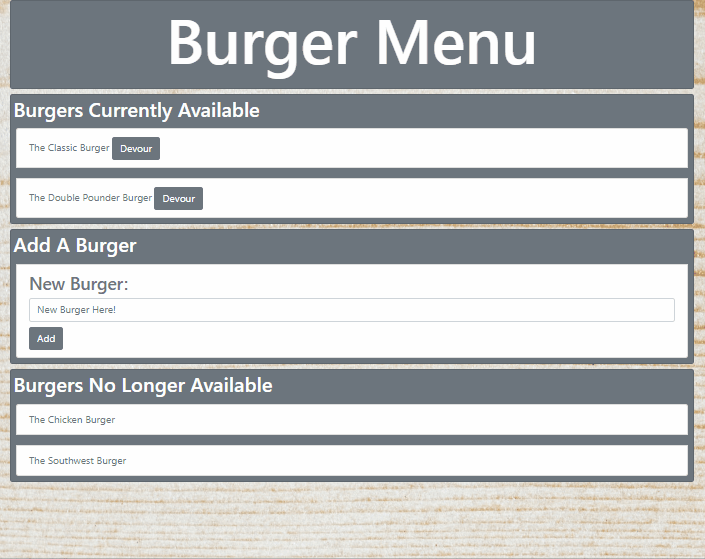
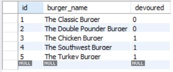

# BURGER MENU

## WHAT IS IT?

This is a database app that allows the user to manipulate a MySQL database using node.js. Using the MVC framework, a user can insert and remove burgers from an availability list.

## GIF

## MySQL

This project uses a single table that allows the user to insert new burgers into the table and change the "devoured" column from false to true.

## TECHNOLOGIES APPLIED

- MVC Framework
- MySQL database
- Bootstrap CSS
- node.js
    NPM Packages
    - mysql
    - express
    - body-parser
    - cli-table